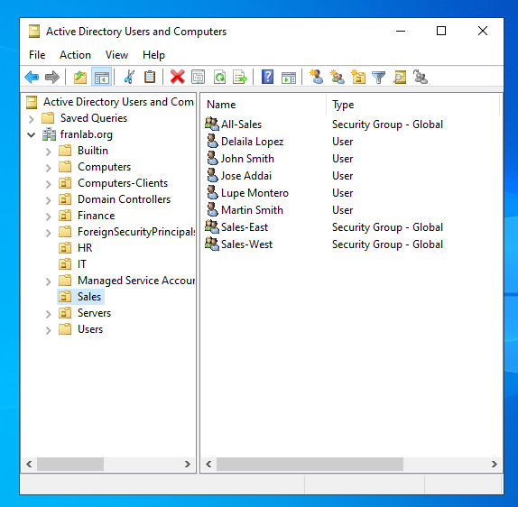
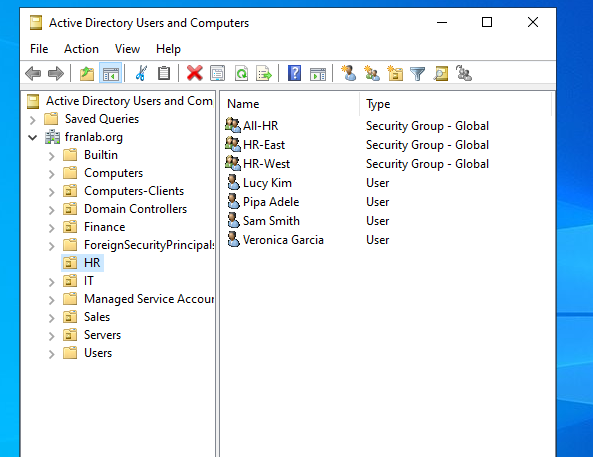
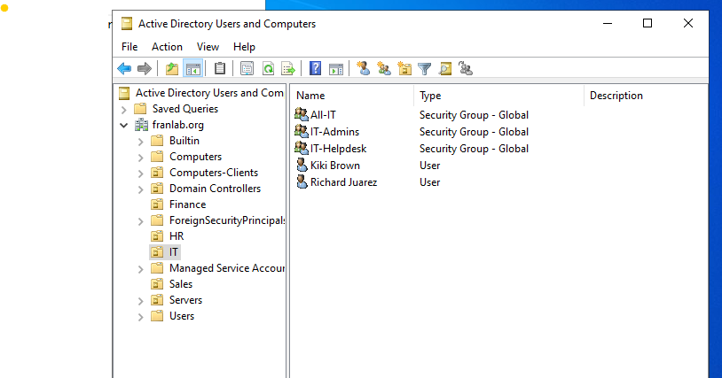
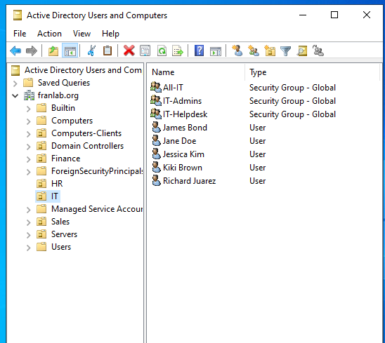
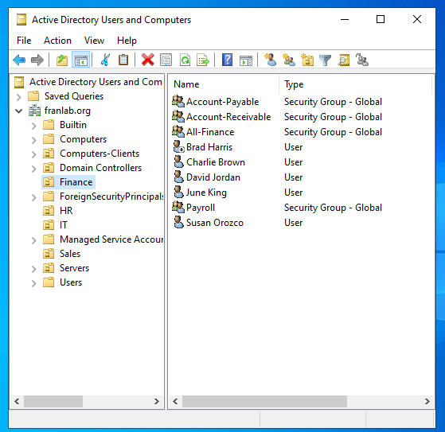

# Enterprise-Virtual-Lab

A hands-on, virtualized enterprise infrastructure built on Windows Server 2022 designed to simulate real-world Active Directory Domain Services (AD DS) management and automated user lifecycle provisioning using custom PowerShell scripting.

---

## 📌 Project Overview

Managing enterprise identity manually across multiple departments leads to human error and high operational overhead. This lab demonstrates:
1. **Infrastructure Setup:** Designing a multi-departmental Active Directory structure from scratch.
2. **Identity & Access Management:** Structuring Organizational Units (OUs) and Security Groups to reflect organizational hierarchy.
3. **Automated Provisioning Pipeline:** Developing a PowerShell script to ingest structured CSV data, validate attributes, create Active Directory accounts, and automatically route users to their designated OUs and Security Groups.

---

## 🛠️ Environment & Tools

| Component | Technical Details |
| :--- | :--- |
| **Hypervisor** | VMware Workstation |
| **Server OS** | Windows Server 2022 |
| **Domain Services** | `franclab.org` |
| **Core Services** | AD DS, DNS, DHCP |
| **Automated** | PowerShell, RSAT (ActiveDirectory module) |
| **Data Ingestion** | Structured CSV (`newUsers.csv`) |

---

## ⚙️ The Automation Pipeline

Managing enterprise identities manually is prone to errors. To solve this, I developed a PowerShell script that ingests a structured CSV file and fully automates the account lifecycle.

### 1. The Data Source (`newUsers.csv`)
The script reads from `c:\lab-assets\newUsers.csv`. The data must be structured with the following headers to route users correctly:

| FirstName | LastName | Department | PrimaryGroup | SubGroup |
| :--- | :--- | :--- | :--- | :--- |
| John | Doe | IT | All-IT | IT-Admins |
| Jane | Smith | Finance | All-Finance | Payroll |

### 2. Execution & Logic
When the script runs, it performs the following automated actions:
* **Account Generation:** Dynamically generates the `samAccountName` (e.g., `john.doe`) and the User Principal Name (`john.doe@franlab.org`).
* **OU Routing:** Places the user directly into their departmental Organizational Unit based on the CSV data.
* **Security & Compliance:** Assigns a temporary default password (`TempPass123!`) and forces the user to change their password upon their first login.
* **Access Control:** Automatically assigns the user to a Primary Departmental Group and a secondary Sub-Group for granular permission management.
* **Error Handling:** Utilizes `Try/Catch` blocks to catch and log errors without stopping the entire bulk creation process.

---

## 📸 Proof of Concept & Verification

Below is a side-by-side comparison of the Active Directory environment, showing manually created accounts versus the accounts dynamically generated and sorted by the PowerShell script.

<b>💼 Sales Department</b>

| Manual Base Setup | Automated Bulk Provisioning |
|---|---|
|  |  |

<b>👥 Human Resources (HR)</b>

| Manual Base Setup | Automated Bulk Provisioning |
|---|---|
|  |  |

<b>💻 Information Technology (IT)</b>

| Manual Base Setup | Automated Bulk Provisioning |
|---|---|
|  |  |

<b>📊 Finance Department</b>

| Manual Base Setup | Automated Bulk Provisioning |
|---|---|
|  |  |

